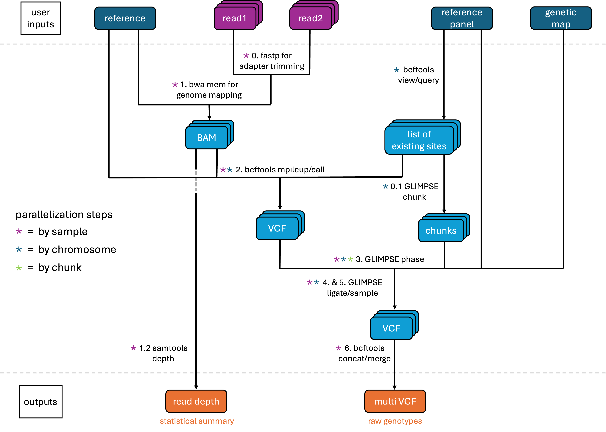

# Finch Genome Imputation
[GLIMPSE](https://odelaneau.github.io/GLIMPSE/glimpse1/index.html)-based pipeline for genomic imputation and variant calling, inspired by [snpArcher](https://snparcher.readthedocs.io/en/latest/index.html)

## Steps for Installation
1. first, you will need to have some conda distribution installed (recommend Miniconda or Miniforge)
2. install snakemake, activate the environment, and install plugins (in the same environment)
    ```bash
    conda create -c conda-forge -c bioconda -n snakemake "snakemake=9.1.10" "python==3.11.4" -y
    conda activate snakemake
    conda install -c conda-forge -c bioconda snakemake-executor-plugin-slurm snakemake-storage-plugin-fs -y
    ```
3. clone this github repo to your machine
    ```bash
    git clone https://github.com/RachelGoodridge/finch_genome_imputation.git
    cd finch_genome_imputation
    ```

## Requirements for Use
- reference genome : include the full path to a .fna file
- phased reference panel : include the full path to a .vcf or .bcf file which contains a panel of high coverage, phased samples
- genetic maps : must be named "chr1.gmap", "chr2.gmap", etc. and contained in a single folder, names must exactly match as in reference genome and reference panel, include the full path to the directory in the config file
- project/config.yaml : must be directly inside project folder and contain full paths
    - options for input_type are local, remote_fs, or NCBI
    - list out all chromosomes to use, which must all be present in the reference/panel/gmaps and chromomsome naming convention must match, Python-style list e.g. ["chr1", "chr1A", "chr2", "chrLGE22", "chrZ"]
- profiles/config.yaml : must be directly inside a folder called "profiles" and contain the slurm account, only required if using slurm
    - set the correct slurm account
    - may also need to select a slurm partition (if not using Cornell's BioHPC), select a partition that will accommodate the resources already specified
    - otherwise, default resources can largely be kept the same
- samples.csv : create a sample sheet with one of the following options, description of columns below, include the full path to a .csv file
    - local or remote (fs) reads : columns required are name,read1,read2,run_num
    - NCBI : columns required are name,srr,run_num

| Field | Description |
| -------- | -------- |
| name | a unqiue identifier for each sample (unless sample has more than one run) |
| read1 | full path to the forward read (whether local or remote) |
| read2 | full path to the reverse read (whether local or remote) |
| srr | SRR (Sequence Read Archive Run), the specific accession identifier used by NCBI's Sequence Read Archive (SRA) |
| run_num | the integer run number (should be 1 for most samples) |

## Instructions for Running
1. activate the snakemake environment and change to the directory containing the snakefile
    ```bash
    conda activate snakemake
    cd finch_genome_imputation
    ```
2. run with one of the following commands
    - without SLURM
        ```bash
        snakemake --sdm conda -d path/to/project -c #cores
        ```
    - with SLURM
        ```bash
        snakemake --workflow-profile path/to/profiles -d path/to/project --scheduler greedy
        ```
3. to clean up temp files afterwards, if needed
    ```bash
    snakemake --delete-temp-output -d path/to/project
    ```

## Output
output is generated within the project directory
- a .snakemake directory containing conda environments and snakemake logs
- a logs directory with specific logs for various snakemake rules
- a panels directory containing sites for imputation from the reference panel, per chromosome
- a results directory
    - 1.2_depth: a depth directory containing per sample per chromosome statistics
    - 6_merged: a directory containing per sample vcf files (useful for re-rerunning the pipeline to add additional samples)
    - 3 depth statistics .csv files: one averaged per chromosome, one averaged per sample, and one split both ways
    - a final zipped and indexed vcf file (with filled info columns) of all samples/chromosomes and accompanying stats file


## Pipeline Schematic

